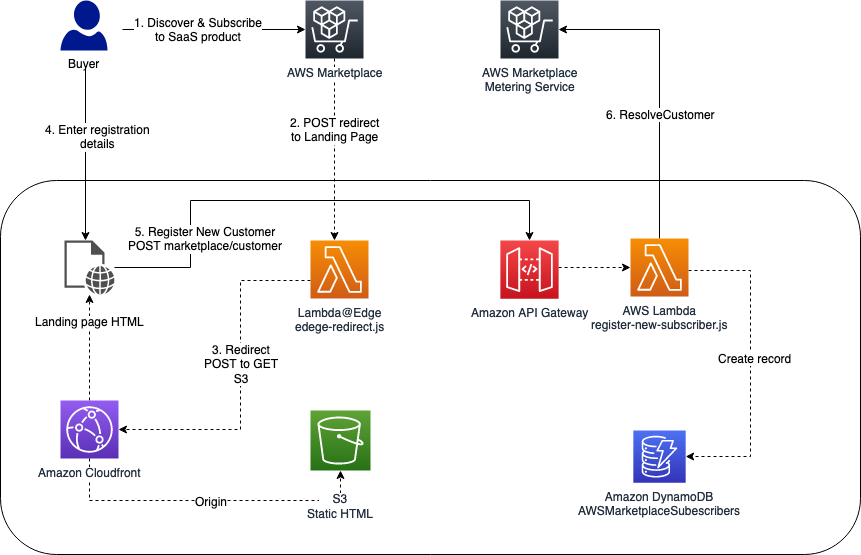
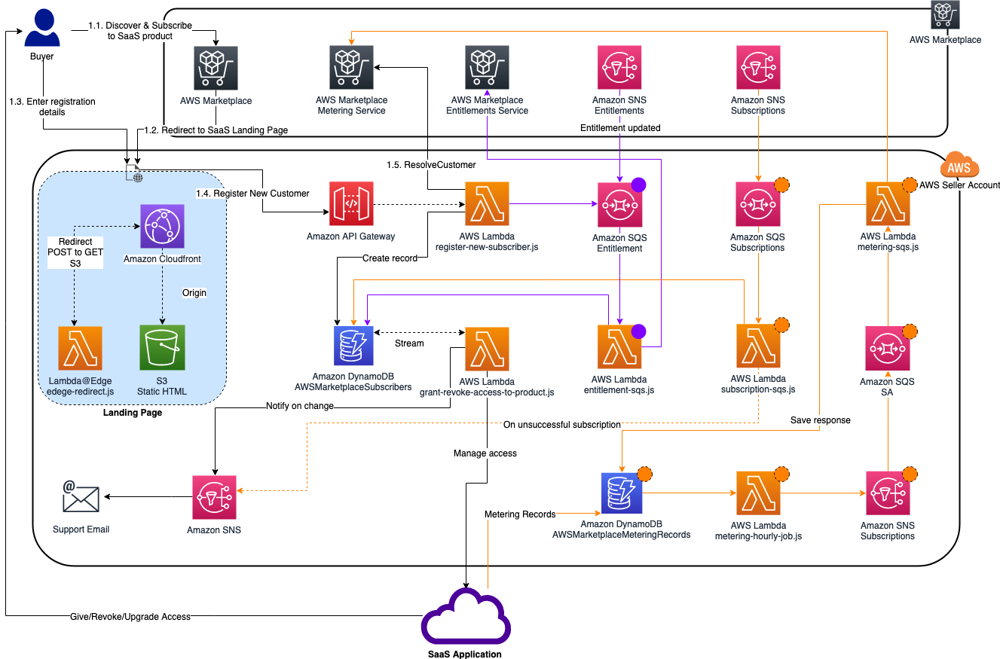

# AWS Marketplace - Serverless integration for SaaS products (Example)


This project provides example of serverless integration for SaaS products listed on the AWS Marketplace. 

If you are a new seller on AWS Marketplace, we advise you to check the following  resources: 

* [SaaS Product Requirements & Recommendations](https://docs.aws.amazon.com/marketplace/latest/userguide/what-is-marketplace.html) : This document outlines the requirements that must be met before gaining approval to publish a SaaS product to the catalog.
* [SaaS Listing Process & Integration Guide](https://awsmp-loadforms.s3.amazonaws.com/AWS+Marketplace+-+SaaS+Integration+Guide.pdf) : This document outlines what is required to integrate with Marketplace for each SaaS pricing model. You will find integration diagrams, codes examples, FAQs, and additional resources.
* [SaaS Integration Video](https://www.youtube.com/watch?v=glG44f-L8us) : This video guides you through the requirements and steps needed to integrate. 
* [SaaS Pricing Video](https://www.youtube.com/watch?v=E0uWp8nhzAk) : This video guides you through the pricing options available when choosing to list a SaaS product.
* [AWS Marketplace - Seller Guide](https://docs.aws.amazon.com/marketplace/latest/userguide/what-is-marketplace.html) : This document covers more information about creating a SaaS product, pricing, and setting up your integration.


# Project Structure

The sample in this repository demonstrates how to use AWS SAM (Serverless application mode) to integrate your SaaS product with AWS Marketplace and how to perform:

- [Register new customers](#register-new-customers)
- [Grant and revoke access to your product](#grant-and-revoke-access-to-your-product)
- [Metering for usage](#metering-for-usage)


## Register new customers

With SaaS subscriptions and SaaS contracts, your customers subscribe to your products through AWS Marketplace, but access the product on environment you manage in your AWS account. After subscribing to the product, your customer is directed to a website you create and manage as a part of your SaaS product to register their account and configure the product.

When creating your product, you provide a URL to your registration landing page. AWS Marketplace uses that URL to redirect customers to your registration landing page after they subscribe. On your software's registration URL, you collect whatever information is required to create an account for the customer. AWS Marketplace recommends collecting your customer’s email addresses if you plan to contact them through email for usage notifications.

The registration landing page needs to be able to identify and accept the x-amzn-marketplace-token token in the form data from AWS Marketplace with the customer’s identifier for billing. It should then pass that token value to the AWS Marketplace Metering Service and AWS Marketplace Entitlement Service APIs to resolve for the unique customer identifier and corresponding product code.


> NOTE: Deploying the static landing page is optional.
You can choose to use your existing SaaS registration page, after collecting the data you should call the register new subscriber endpoint. Please see the deployment section.

### Implementation

In this sample we created CloudFront Distribution, which can be configured to use domain/CNAME by your choice. The POST request coming from AWS Marketplace is intercepted by the Edge `src/lambda-edge/edge-redirect.js`, which transforms the POST request to GET request, and passes the x-amzn-marketplace-token in the query string. 
We have created static HTML page hosted on S3 which takes the users inputs defined in the html form and submits them to marketplace/customer endpoint.

The handler for the marketplace/customer endpoint is defined in the `src/register-new-subscriber.js` file, where we call the `resolveCustomer` and validate the token. If the token is valid the customer record is created in the `AWSMarketplaceSubscribers` DynamoDB table and the new customer data are stored.



## Grant and revoke access to your product

### Grant access to new subscribers

Once the resolveCustomer endpoint return successful response, the SaaS vendors must to provide access to the solution to the new subscriber. 
Based on the type of listing contract or subscription we have defined different conditions in the `grant-revoke-access-to-product.js` stream handler that is executed on adding new or updating existing rows.

In our implementation the Marketplace Tech Admin (The email address you have entered when deploying), will receive email when new environment needs to be provisioned or existing environment needs to be updated. AWS Marketplace strongly recommends automating the access and environment management which can be achieved by modifying the `grant-revoke-access-to-product.js` function.

The property successfully subscribed is set when successful response is returned from the SQS entitlement handler for SaaS Contract based listings or after receiving **subscribe-success message from the Subscription SNS Topic in the case of AWS SaaS subscriptions in the `subscription-sqs-handler.js`.


### Update entitlement levels to new subscribers (SaaS Contracts only)

Each time the entitlement is update we receive message on the SNS topic. 
The lambda function `entitlement-sqs.js` on each message is calling the marketplaceEntitlementService and storing the response in the dynamoDB.

We are using the same DynamoDB stream to detect changes in the entailment for SaaS contracts. When the entitlement is update notification is sent to the `MarketplaceTechAdmin`.


### Revoke access to customers with expired contracts and cancelled subscriptions 

The revoke access logic is implemented in a similar manner as the grant access logic. 

In our implementation the `MarketplaceTechAdmin` receives email when the contract expires or the subscription is cancelled. 
AWS Marketplace strongly recommends automating the access and environment management which can be achieved by modifying the `grant-revoke-access-to-product.js` function.

## Metering for usage

For SaaS subscriptions, the SaaS provider must meter for all usage, and then customers are billed by AWS based on the metering records provided. For SaaS contracts, you only meter for usage beyond a customer’s contract entitlements. When your application meters usage for a customer, your application is providing AWS with a quantity of usage accrued. Your application meters for the pricing dimensions that you defined when you created your product, such as gigabytes transferred or hosts scanned in a given hour.

### Implementation

We have created MeteringSchedule CloudWatch Event rule that is **triggered every hour**. The `metering-hourly-job.js` gets triggered by this rule and it's querying all of the pending/unreported metering records from the `AWSMarketplaceMeteringRecords` table using the PendingMeteringRecordsIndex.
All of the pending records are aggregated based on the customerIdentifier and dimension name, and sent to the SQSMetering queue.
The records in the `AWSMarketplaceMeteringRecords` table are expected to be inserted programmatically by your SaaS application. In this case you will have to give permissions to the service in charge of collecting usage data in your existing SaaS product to be able to write to `AWSMarketplaceMeteringRecords` table. 

The lambda function `metering-sqs.js` is sending all of the queued metering records to the AWS marketplace Metering API.
After every call to the `batchMeterUsage` endpoint the rows are updated in the AWSMarketplaceMeteringRecords table, with the response returned from the Metering Service, which can be found in the `metering_response` field. If the request was unsuccessful the metering_failed value with be set to true and you will have to investigate the issue the error will be also stored in the `metering_response` field.

The new records in the AWSMarketplaceMeteringRecords table should be stored in the following format:


```javascript
{
  "create_timestamp": 113123,
  "customerIdentifier": "ifAPi5AcF3",
  "dimension_usage": [
    {
      "dimension": "users",
      "value": 3
    },
     {
      "dimension": "admin_users",
      "value": 1
    }
  ],
  "metering_pending": "true"
}
```

Where the `create_timestamp` is the sort key and `customerIdentifier` is the partition key, and they are both forming the Primary key.
The AWSMarketplaceMeteringRecords table

After the record is submitted to AWS Marketplace API, it will be updated and I.E. will look like this:

```javascript
{
  "create_timestamp": 113123,
  "customerIdentifier": "ifAPi5AcF3",
  "dimension_usage": [
    {
      "dimension": "admin_users",
      "value": 3
    }
  ],
  "metering_failed": false,
  "metering_response": "{\"Results\":[{\"UsageRecord\":{\"Timestamp\":\"2020-06-24T04:04:53.776Z\",\"CustomerIdentifier\":\"ifAPi5AcF3\",\"Dimension\":\"admin_users\",\"Quantity\":3},\"MeteringRecordId\":\"35155d37-56cb-423f-8554-5c4f3e3ff56d\",\"Status\":\"Success\"}],\"UnprocessedRecords\":[]}"
}
```

## Deploy the sample application

The Serverless Application Model Command Line Interface (SAM CLI) is an extension of the AWS CLI that adds functionality for building and testing Lambda applications. It uses Docker to run your functions in an Amazon Linux environment that matches Lambda. It can also emulate your application's build environment and API.

To use the SAM CLI, you need the following tools.

* SAM CLI - [Install the SAM CLI](https://docs.aws.amazon.com/serverless-application-model/latest/developerguide/serverless-sam-cli-install.html)
* Node.js - [Install Node.js 10](https://nodejs.org/en/), including the NPM package management tool.
* Docker - [Install Docker community edition](https://hub.docker.com/search/?type=edition&offering=community)
* Email verification - [Verify an email address](https://docs.aws.amazon.com/ses/latest/DeveloperGuide/verify-email-addresses-procedure.html): This document gives step by step instructions to verify email address that will be used as your SELLERSESVERIFIEDEMAILADDRESS address later)

To build and deploy your application for the first time, run the following in your shell:

```bash

#Replace all `<PLACEHOLDER_VALUES>` with their `actual values` (e.g. `<PROJECT_NAME>` with `My Cool Project`).

sam build
sam package --output-template-file packaged.yaml --s3-bucket <DEPLOYMENT_ARTEFACT_S3_BUCKET>


sam deploy --template-file packaged.yaml --stack-name <STACK_NAME> --capabilities CAPABILITY_IAM \
--region us-east-1 \
--parameter-overrides \
ParameterKey=WebsiteS3BucketName,ParameterValue=<WEBSITE_BUCKET_NAME> \
ParameterKey=ProductCode,ParameterValue=<MARKETPLACE_PRODUCT_CODE> \
ParameterKey=EntitlementSNSTopic,ParameterValue=<MARKETPLACE_ENTITLEMENT_SNS_TOPIC> \
ParameterKey=SubscriptionSNSTopic,ParameterValue=<MARKETPLACE_SUBSCRIPTION_SNS_TOPIC> \
ParameterKey=MarketplaceTechAdminEmail,ParameterValue=<MARKETPLACE_TECH_ADMIN_EMAIL> \

#If you want to notify your buyer of successful purchase then you can use the following to deploy your application
sam deploy --template-file packaged.yaml --stack-name <STACK_NAME> --capabilities CAPABILITY_IAM \
--region us-east-1 \
--parameter-overrides \
ParameterKey=WebsiteS3BucketName,ParameterValue=<WEBSITE_BUCKET_NAME> \
ParameterKey=ProductCode,ParameterValue=<MARKETPLACE_PRODUCT_CODE> \
ParameterKey=EntitlementSNSTopic,ParameterValue=<MARKETPLACE_ENTITLEMENT_SNS_TOPIC> \
ParameterKey=SubscriptionSNSTopic,ParameterValue=<MARKETPLACE_SUBSCRIPTION_SNS_TOPIC> \
ParameterKey=MarketplaceTechAdminEmail,ParameterValue=<MARKETPLACE_TECH_ADMIN_EMAIL> 
ParameterKey=MarketplaceSellerEmail,ParameterValue=<SELLERSESVERIFIEDEMAILADDRESS>

#Check the accoutn for <MARKETPLACE_TECH_ADMIN_EMAIL> and approve the subscription to SNS

#Replace the baseUrl in web/script.js with the API Gateway endpoint URL 

aws s3 cp ./web/ s3://<WEBSITE_BUCKET_NAME>/ --recursive

#add a CNAME record to your DNS to route the url you put on your offering to the cloudformation endpoint

#add the domain used for your maretplace URL to the CNAME on the cloudformation config
```
### List of parameters

Parameter name | Description
------------ | -------------
WebsiteS3BucketName | S3 bucket to store the HTML files; Mandatory if CreateRegistrationWebPage is set to true;
NewSubscribersTableName | Use custome name for the New Subscribers Table; Default value: AWSMarketplaceSubscribers
AWSMarketplaceMeteringRecordsTableName | Use custome name for the Metering Records Table; Default value: AWSMarketplaceMeteringRecords
TypeOfSaaSListing | allowed values: contracts_with_subscription, contracts, subscriptions; Default value: contracts_with_subscription
ProductCode | Product code provided from AWS Marketplace
EntitlementSNSTopic | SNS topic ARN provided from AWS Marketplace
SubscriptionSNSTopic | SNS topic ARN provided from AWS Marketplace
CreateRegistrationWebPage | true or false; Default value: true
MarketplaceTechAdminEmail | Email to be notified on changes requring action
MarketplaceSellerEmail | Seller SES verified email address


### Diagram of created resources

Based on the value of the **TypeOfSaaSListing** parameter different set of resources will be created. 

In the case of *contracts_with_subscription* all of the resources depicted on the diagram below will be created.

In the case of a *contracts*, the resources market with orange circles will not be created.

In the case of a *subscriptions* the resources market with purple circles will not be created.

The landing page is optional. Use the CreateRegistrationWebPage parameter.





## Cleanup

To delete the sample application that you created, use the AWS CLI. Assuming you used your project name for the stack name, you can run the following:

```bash
aws cloudformation delete-stack --stack-name app
```


## Security

See [CONTRIBUTING](CONTRIBUTING.md#security-issue-notifications) for more information.

## License

This library is licensed under the MIT-0 License. See the LICENSE file.
